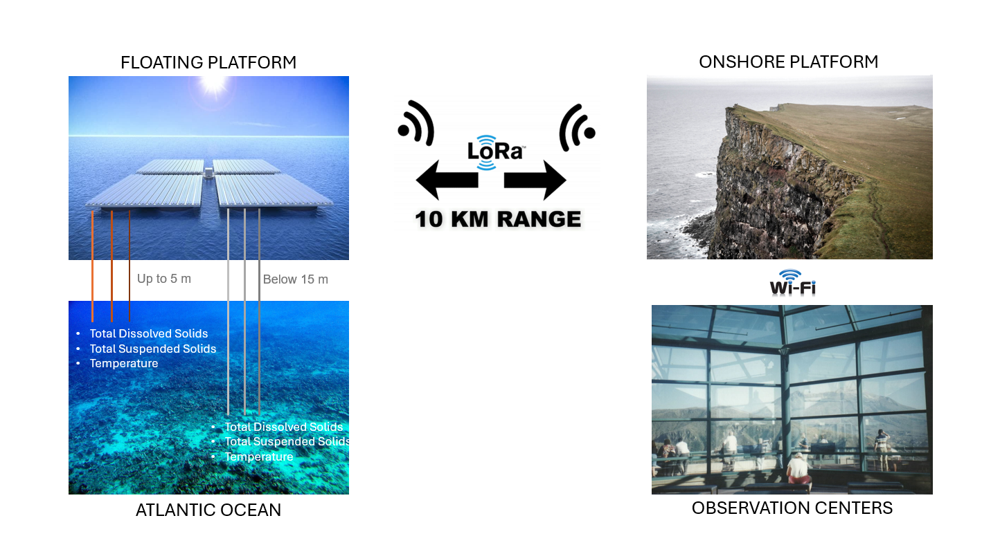

# Marine Telemetry IoT System

## Project Overview

This project is a proof-of-concept for a marine telemetry IoT system that monitors environmental data remotely using a **floating platform**, **onshore platform**, and an **observational center**. The floating platform collects real-time data on temperature, Total Dissolved Solids (TDS), and Total Suspended Solids (TSS) using various sensors, then transmits it via LoRa to the onshore platform for processing and future analysis.



Click on the image below to watch a video of the data flow.

[](https://www.youtube.com/watch?v=xaF3v0I2ETI)

---

## Platforms and Data Flow

- **Floating Platform**: 
   - *Hardware*: Raspberry Pi Zero 2 W, Wio E5 Mini LoRa, two Wemos D1 Minis with Dallas temperature, TDS, and TSS sensors, all powered by a solar power bank.
   - *Function*: Collects sensor data and sends it via LoRa to the onshore platform.

- **Onshore Platform**:
   - *Hardware*: Raspberry Pi Zero 2 W and Wio E5 Mini LoRa.
   - *Function*: Receives incoming LoRa messages and posts data to an MQTT broker.

- **Observational Center**:
   - *Access*: Data is accessed via Wi-Fi for remote monitoring and analysis.

- **Current Status**: 
   - Devices are housed in makeshift enclosures for testing, with sensors in water containers. Deployment on water is pending further testing.


---

## System Architecture

1. **Floating Platform**: Captures and transmits sensor data via LoRa.
2. **Onshore Platform**: Receives LoRa transmissions and posts data to an MQTT broker.
3. **Observational Center**: Connects to the onshore platform via Wi-Fi to access data.


---

## Components

### Floating Platform

**Hardware**:
- **Raspberry Pi Zero 2 W**
- **Wio E5 Mini LoRa Module**
- **2 x Wemos D1 Minis**
   - **Wemos 1**: Dallas temperature sensor + DFRobot SEN0244 TDS sensor
   - **Wemos 2**: DFRobot SEN0189 TSS sensor
- **Solar Power Bank**

**Software**:
- **Arduino Sketches**: Code for Wemos devices to read sensors and transmit data via USB serial to the Raspberry Pi.
- **Python Script**: Runs on the Raspberry Pi to read data from Wemos and re-transmit via LoRa.

### Onshore Platform

**Hardware**:
- **Raspberry Pi Zero 2 W**
- **Wio E5 Mini LoRa Module**

**Software**:
- **Python Script**: Listens for LoRa messages, parses sensor data, and publishes it to an MQTT broker on localhost.

### Observational Center

**Hardware**:
- Computer or mobile device

**Software**:
- **MQTT Client**: For viewing transmitted data via Wi-Fi.

---

## Setup Guide

## Floating Platform

### Prerequisites

1. **Install Raspberry Pi OS** on a microSD card. 
   - Ensure Wi-Fi credentials are configured so you can access the Pi on the same network.
   - Activate SSH for remote access.

2. **Arduino IDE** Installation and Configuration
   - Install the Arduino IDE on your computer.
   - Add ESP8266 Board Support:
         Go to File > Preferences.
         In the "Additional Board Manager URLs" field, add:
         ```url
               http://arduino.esp8266.com/stable/package_esp8266com_index.json
         ```
         Go to Tools > Board > Board Manager, search for "ESP8266," and install the ESP8266 board package.

   - Install Required Libraries:

      Go to Sketch > Include Library > Manage Libraries and search for the following libraries:
         - DallasTemperature (for the DS18B20 temperature sensor).
         - OneWire (required for DallasTemperature).

### Hardware Setup


## Wemos Device Configuration

### Setup for Wemos_1

The first Wemos device will be transmitting two values to the system: temperature and TDS.

To connect the sensors to Wemos, use various methods (pin board or direct soldering). Ensure the contact is solid and there are no shorted pins.

To connect the TDS sensor, connect the three wires from the sensor board to Wemos:

- GND
- VCC (3.3V)
- A0

To connect the Dallas temperature sensor, connect it to:

- GND
- VCC (5V)
- D4


Also, a 4.7k resistor is needed to connect VCC and data wires.


Connect the Wemos device to your computer over USB.


Open an Arduino sketch from the repository for Wemos_1, compile the code, and upload it to the Wemos.

Check the serial monitor; switch to 115200 baud, and you should see readings A: xx.xx for temperature and B: xxx.xx for TDS.

### Setup for Wemos_2

Now connect the remaining TSS sensor to another Wemos.

Connection pins:

- GND
- VCC (3.3V)
- A0

The second Wemos is necessary since the Wemos D1 Mini has just one analog input pin. If using other Arduino boards with multiple analog inputs, this setup and the code would differ.

Flash the sketch from the Wemos_2 folder onto the second Wemos device.

Check the serial output; it should give C: XX for the analog value, D: XX.XX voltage, and C: XXXX for the TSS value.


### Raspberry Pi Configuration


1. **Power the Raspberry Pi** using a solar power bank. 
2. Wait a couple of minutes, then use another device to get a list of connected devices on the network to identify the Raspberry Pi's IP address:
   ```bash
   
   nmap -sP xxx.xxx.xxx.0/24

3. Connect to the Raspberry Pi using SSH:
   ```bash

   ssh -p 22 username@xxx.xxx.xxx.xxx
   ```

4. After a successful connection, copy the floating platform Python files to the user directory:
   ```bash
   scp username@<IP Address of Raspberry Pi>:<Path to File> .
   ```

5. Configure Services on Raspberry Pi
   - Create a service file for usb_order.py
      Navigate to /etc/systemd/system/ and create a file named usb_order.service:
      ```
      [Unit]
      Description=Run usb_order.py at boot with a delay
      After=network.target

      [Service]
      ExecStart=/bin/bash -c 'sleep 30; /usr/bin/python /home/sensor/usb_order.py'
      WorkingDirectory=/home/sensor/
      StandardOutput=journal
      StandardError=journal
      Restart=always

      [Install]
      WantedBy=multi-user.target
      ```

   - Create a service file for watcher.py
      In the same folder, create another file named watcher.service:
      ```
      [Unit]
      Description=Run watcher.py at boot with a delay
      After=network.target

      [Service]
      ExecStart=/bin/bash -c 'sleep 60; /usr/bin/python /home/sensor/watcher.py'
      WorkingDirectory=/home/sensor/
      StandardOutput=journal
      StandardError=journal
      Restart=always

      [Install]
      WantedBy=multi-user.target
      ```

   - Enable the services:
      ```bash
      sudo systemctl enable usb_order.service
      sudo systemctl enable watcher.service
      sudo systemctl daemon-reload
      ```

 6. Python Environment Setup
   - Prepare the Python environment for the scripts.
      Install the necessary library on the floating platform: pyserial, which is essential for communicating with the LoRa and Wemos devices.

      Install it using your preferred method (pip or apt):
      ```bash
      pip install pyserial
      ```
      or
      ```bash
      sudo apt install python3-pyserial
      ```


### Final Connections
Connect both Wemos devices and the LoRa module to a USB hub and connect it to the Raspberry Pi.


Reboot the Raspberry Pi. The script will identify the devices by their output and create a config file mapping ttyUSB ports, which is in the usb_order.config file.

When the watcher service starts, it will send an email to a preconfigured address with the credentials. If using Gmail, generate an access token for this application and insert it into the code. The email will contain the internal and external IPs of the Raspberry Pi and a log file of the watcher service.


## On-shore Platform

### Prerequisites

1. **Install Raspberry Pi OS** on a microSD card. 
   - Ensure Wi-Fi credentials are configured so you can access the Pi on the same network.
   - Activate SSH for remote access.

### Raspberry Pi Configuration


1. **Power the Raspberry Pi** using a solar power bank. 
2. Wait a couple of minutes, then use another device to get a list of connected devices on the network to identify the Raspberry Pi's IP address:
   ```bash
   
   nmap -sP xxx.xxx.xxx.0/24

3. Connect to the Raspberry Pi using SSH:
   ```bash

   ssh -p 22 username@xxx.xxx.xxx.xxx
   ```

4. After a successful connection, copy the on-shore platform Python files to the user directory:
   ```bash
   scp username@<IP Address of Raspberry Pi>:<Path to File> .
   ```

5. Configure Services on Raspberry Pi
   
   - Create a service file for watcher.py
      In the same folder, create another file named watcher.service:
      ```
      [Unit]
      Description=Run watcher.py at boot with a delay
      After=network.target

      [Service]
      ExecStart=/bin/bash -c 'sleep 60; /usr/bin/python /home/onshore/watcher.py'
      WorkingDirectory=/home/onshore/
      StandardOutput=journal
      StandardError=journal
      Restart=always

      [Install]
      WantedBy=multi-user.target
      ```

   - Enable the service:
      ```bash
      sudo systemctl enable watcher.service
      sudo systemctl daemon-reload
      ```

 6. Python Environment Setup
   - Prepare the Python environment for the scripts.
      Install the necessary library pyserial, which is needed for communication with the LoRa device.

      Install it using your preferred method (pip or apt):
      ```bash
      pip install pyserial
      ```
      or
      ```bash
      sudo apt install python3-pyserial
      ```

   7. Install the MQTT broker
      ```bash
      sudo apt install mosquitto
      ```
      
### Final Connections


Connect the LoRa module to a USB port on the Raspberry Pi.

Reboot the Raspberry Pi. 

When the watcher service starts, it will as well send an email to a preconfigured address. The email will contain also the internal and external IPs of the Raspberry Pi and a log file of the watcher service.

## Observational Center

At the moment data monitoring tools that are used on the observational center could vary. 
- MQTT Explorer app (cross platform)
- mqtt_sub_graph2.py script included in the repository
- Or any other MQTT subscriber with clear graph data representation.


## Final Notes


- After successfully connecting and configuring all devices, upon boot, you should receive confirmation emails indicating that the system is fully operational.

- The Raspberry Pi on the on-shore platform will send AT commands to the LoRa device over a serial connection, putting it in receiving mode to await incoming LoRa messages. It will identify each message upon reception and repost it to the appropriate MQTT broker topic.
- After boot, the Raspberry Pi on the floating platform will read serial data from both Wemos devices and retransmit it to other LoRa devices via the LoRa device’s serial connection using AT commands.

  
